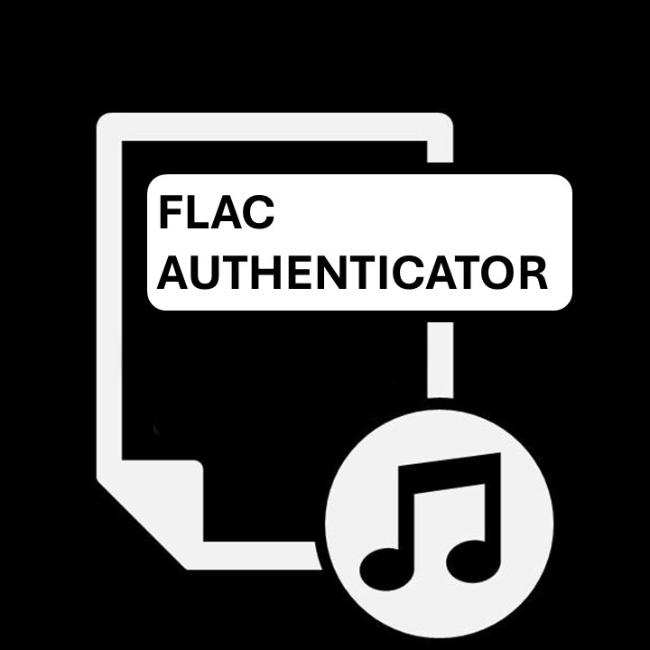

<!-- PROJECT LOGO -->
<br />
<div align="center">
  <a href="https://github.com/Mandache-Eduard/flac-authenticator">
    
  </a>

<h3 align="center">FLAC Authenticator</h3>

___

  <p align="center">
    A small tool that analyzes FLAC audio files to determine whether they are true lossless sources or upscaled from lower-quality formats.
    <br />
    <a href="https://github.com/Mandache-Eduard/flac-authenticator/blob/main/docs/OVERVIEW.md"><strong>Explore the docs »</strong></a>
    <br />
    <br />
    <a href="https://github.com/github_username/repo_name"><strong>View Demo (To be added)</a>
    &middot;
    <a href="https://github.com/Mandache-Eduard/flac-authenticator/issues/new?labels=bug&template=bug_report.md"><strong>Report Bug</a>
    &middot;
    <a href="https://github.com/Mandache-Eduard/flac-authenticator/issues/new?labels=enhancement&template=feature_or_request.md"><strong>Request Feature</a>
  </p>
</div>

<!-- TABLE OF CONTENTS -->
<details>
  <summary>Table of Contents</summary>
  <ol>
    <li><a href="#about-the-project">About The Project</a></li>
    <li><a href="#disclaimer">Disclaimer</a></li>
    <li><a href="#requierements">Requirements</a></li>
    <li><a href="#installation">Installation</a></li>
    <li><a href="#usage">Usage</a></li>
    <li><a href="#roadmap">Roadmap</a></li>
    <ul>
        <li><a href="#future-features">Future features</a></li>
        <li><a href="#features-in-development">Features in developments</a></li>
        <li><a href="#completed-features">Completed features</a></li>
      </ul>
    <li><a href="#contributing">Contributing</a></li>
    <li><a href="#license">License</a></li>
    <li><a href="#contact">Contact</a></li>
    <li><a href="#acknowledgments">Acknowledgments</a></li>
  </ol>
</details>

<!-- ABOUT THE PROJECT -->
## About The Project

This is a program that scans FLAC audio files to determine whether they are genuinely lossless or upscaled from lower-quality sources. It's my first project written in [![Python][Python-shield]][Python-url] and serves as a hands-on way to explore concepts related to data analysis and data engineering. Built as a personal hobby project, it is intended to remain free and open-source, and to provide a simple, transparent alternative to existing tools that are either paid or limited in functionality

___

<!-- DISCLAIMER -->
## Disclaimer

This project is currently in **an early, experimental stage** and should be considered a prototype rather than a definitive verification tool. Determining whether a FLAC file is truly lossless is inherently complex and depends on multiple factors, such as spectral analysis, encoding characteristics, frequency cutoffs, metadata consistency, checksums (e.g. MD5), and knowledge of the original source and production chain. This tool, in its current stage, only covers a subset of these aspects and **does not guarantee** correct results in all cases; in particular, it currently focuses more on analyzing audio quality characteristics than on conclusively establishing the true origin of a file. As a result, it may produce **false positives (upscaled files identified as genuine)** or **false negatives (genuine files flagged as upscaled)**. Users are **strongly encouraged** to manually review and double-check files reported with low confidence — using additional tools and their own judgment.

___

<!-- REQUIREMENTS -->
## Requirements

Pyhton version: 3.14t (free-threaded)
External utilities: FFMPEG

___

<!-- INSTALLATION -->
## Installation

1. Get a free API Key at [https://example.com](https://example.com)
2. Clone the repo
   ```sh
   git clone https://github.com/github_username/repo_name.git
   ```
3. Install NPM packages
   ```sh
   npm install
   ```
4. Enter your API in `config.js`
   ```js
   const API_KEY = 'ENTER YOUR API';
   ```
5. Change git remote url to avoid accidental pushes to base project
   ```sh
   git remote set-url origin github_username/repo_name
   git remote -v # confirm the changes
   ```
___

<!-- USAGE EXAMPLES -->
## Usage

Use this space to show useful examples of how a project can be used. Additional screenshots, code examples and demos work well in this space. You may also link to more resources.

_For more examples, please refer to the [Documentation](https://example.com)_

___

<!-- ROADMAP -->
## Roadmap

### Future features
- [ ] Expand the program to also scan MP3 and other file formats to detect upscaling/authenticiy.
- [ ] Implement a local database, to avoid scanning already scanned files and only focus on files added since last scan
- [ ] Implement different checks for .flac files (audio artifacts, checksums, etc.)
- [ ] Add file recognition from MusicBrainz Picard Database/AcoustID!
    - [ ] Fetch metadata and let the user choose to update it
- [ ] Create a UI for ease of use
    - [ ] Rewrite program for multithreading (1 thread for UI, 1 thread for file processing)
    - [ ] Provide both dark and light themes

### Features in development
- [ ] Implement FFmpeg spectrogram creation for low-confidence files

### Completed features
- [X] Implement a loading bar to visualize progress
- [X] Save results in a log file (.CSV)
- [X] Scan a folder structure recursively
- [X] Scan multiple files in one run

___

<!-- CONTRIBUTING -->
## Contributing

Contributions and feedback are a big part of what makes open-source projects such a great place to learn and grow, and they are always appreciated.

If you notice a bug, have a suggestion, or think something could be improved, feel free to open an issue and describe it in detail. I value constructive criticism highly and will review reported issues whenever I have the time. I prefer to implement new features and fixes myself, as the primary goal is learning through hands-on development. That said, your insights and observations are very welcome and genuinely helpful.

If you’d like to support the project, giving it a star is always appreciated. Thank you for taking the time to check it out!

___

<!-- LICENSE -->
## License

Distributed under the GNU General Public License v3.0-only. See `LICENSE` or click the link below for more information.
<br>
[](https://www.gnu.org/licenses/gpl-3.0)

___

<!-- CONTACT -->
## Contact

Mandache Eduard
<br>
[![LinkedIn][LinkedIn-shield]][LinkedIn-url]
<br>

<br>
Project Link: [https://github.com/Mandache-Eduard/flac-authenticator](https://github.com/Mandache-Eduard/flac-authenticator)

___

<!-- ACKNOWLEDGMENTS -->
## Acknowledgments

* [Best README Template](https://github.com/othneildrew/Best-README-Template)
* [Choose an Open Source License](https://choosealicense.com)

<!-- MARKDOWN LINKS & IMAGES -->
<!-- https://www.markdownguide.org/basic-syntax/#reference-style-links -->
[License-shield]: https://img.shields.io/github/license/github_username/repo_name.svg?style=for-the-badge
[License-url]: https://github.com/github_username/repo_name/blob/master/LICENSE.txt
[LinkedIn-shield]: https://img.shields.io/badge/-LinkedIn-black.svg?style=for-the-badge&logo=linkedin&colorB=555
[LinkedIn-url]: https://linkedin.com/in/linkedin_username](https://www.linkedin.com/in/eduard-mandache-89588035b/
[Python-shield]: https://img.shields.io/badge/Python-3.13-blue
[Python-url]: https://www.python.org/
