<!-- AUTO-GENERATED:BEGIN -->
## Global Module Call Graph

```mermaid
flowchart TD
    classDef ok fill:#20462d,stroke:#2e7d32;
    classDef err fill:#a1362a,stroke:#c62828;

    audio_frame_analysis["audio_frame_analysis.py"]:::ok
    audio_loader["audio_loader.py"]:::ok
    data_and_error_logging["data_and_error_logging.py"]:::ok
    file_status_determination["file_status_determination.py"]:::ok
    main["main.py"]:::ok
    run_modes["run_modes.py"]:::ok
    spectrogram_generator["spectrogram_generator.py"]:::ok
    main --> run_modes
    run_modes --> audio_frame_analysis
    run_modes --> audio_loader
    run_modes --> data_and_error_logging
    run_modes --> file_status_determination
    run_modes --> spectrogram_generator
```

## Module Index
- [`audio_frame_analysis.md`](audio_frame_analysis.md)
- [`audio_loader.md`](audio_loader.md)
- [`data_and_error_logging.md`](data_and_error_logging.md)
- [`file_status_determination.md`](file_status_determination.md)
- [`main.md`](main.md)
- [`run_modes.md`](run_modes.md)
- [`spectrogram_generator.md`](spectrogram_generator.md)
<!-- AUTO-GENERATED:END -->
