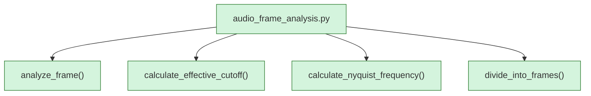

<!-- AUTO-GENERATED:BEGIN -->
## External Dependencies (auto)
### Imports
- `dataclasses.dataclass`
- `numpy`

## Module-level Constants and Variables (auto)
- `CUTOFF_HZ: float = 20500.0`
- `NYQUIST_SAFETY_BAND_HZ: float = 200.0`

## Module Workflow (auto: call graph)

## Function Inventory (auto)
- `analyze_frame(frame, samplerate, effective_cutoff, fft_cache_list)`
- `calculate_effective_cutoff(nyquist_frequency)`
- `calculate_nyquist_frequency(samplerate)`
- `divide_into_frames(data, frame_size, step)`
<!-- AUTO-GENERATED:END -->
