## External Dependencies

### Imports

* `dataclasses.dataclass` — lightweight container for per-frame FFT artifacts.
* `numpy` — numerical array operations, FFTs, windowing, and vectorized math.

## Module-level Constants and Variables

### Constants

* `CUTOFF_HZ: float = 20500.0`
  Probe cutoff frequency in Hz chosen to approximate the high-frequency roll-off commonly observed in ~320 kbps lossy encodes.

* `NYQUIST_SAFETY_BAND_HZ: float = 100.0`
  Safety margin in Hz subtracted from Nyquist so the probe does not sit too close to the Nyquist limit.

### Key runtime variables (created/used by the module’s functions)

* `frames: list[np.ndarray]`
  List of overlapping time-domain frames (each frame is a contiguous slice of the input sample array).

* `frame_size: int = 32768`
  Number of samples per frame.

* `step: int = 16384`
  Hop size in samples between consecutive frames (50% overlap when `step = frame_size / 2`).

* `nyquist_frequency: float`
  Half the samplerate (`samplerate / 2.0`); highest representable frequency in the sampled signal.

* `effective_cutoff: float`
  The cutoff frequency actually used for analysis after clamping to stay below Nyquist:
  `min(CUTOFF_HZ, max(0.0, nyquist_frequency - NYQUIST_SAFETY_BAND_HZ))`.

* `fft_cache_list: list[FrameFFT] | None`
  Optional list passed into `analyze_frame()` to collect per-frame FFT artifacts (freq bins, magnitude spectrum, total energy).

* `single_frame: np.ndarray`
  One time-domain frame (a slice of the full sample array).

* `windowed: np.ndarray`
  Time-domain frame after multiplying by a Hann window (`np.hanning(len(frame))`) to reduce spectral leakage.

* `spectrum: np.ndarray`
  Magnitude spectrum of the frame after real FFT: `abs(rfft(windowed))`. Length is `frame_size/2 + 1`.

* `freqs: np.ndarray`
  Frequency bin centers in Hz for `spectrum`, produced by `np.fft.rfftfreq(frame_size, d=1/samplerate)`.

* `total_energy: float`
  Sum of spectral magnitudes across all bins (`sum(spectrum)`). Used as the denominator for the ratio.

* `high_band_energy: float`
  Sum of spectral magnitudes strictly above `effective_cutoff` (`sum(spectrum[freqs > effective_cutoff])`).

* `ratio: float`
  High-frequency energy fraction for the frame: `high_band_energy / total_energy`. Intended to lie in `[0, 1]` for valid frames.

## Additional Information

### Per-frame High-Frequency Energy Ratio

The core metric computed by this module is the **high-frequency energy ratio** for each audio frame.
For a given frame, the signal is windowed, transformed into the frequency domain using a real FFT, and then analyzed relative to a cutoff frequency (`effective_cutoff`).

For each frame:

* **Total spectral energy** is defined as the sum of all FFT magnitudes.
* **High-band energy** is defined as the sum of FFT magnitudes in bins whose center frequencies are *strictly above* `effective_cutoff`.
* The returned **ratio** is:

```
ratio = high_band_energy / total_energy
```

This ratio is dimensionless and constrained to the interval `[0, 1]` for valid frames.

Interpretation:

* `ratio ≈ 0`
  Indicates little to no meaningful content above the cutoff frequency for that frame (consistent with lossy roll-off).
* Larger ratios
  Indicate the presence of high-frequency content beyond the cutoff, which is more typical of original or lossless sources.

### Cutoff Consistency Across Frames

The `effective_cutoff` value should be computed **once per file** (via `calculate_effective_cutoff(samplerate)`) and reused for all frames derived from that file. This ensures that all per-frame ratios are comparable and correspond to the same physical frequency boundary.

### FFT Caching for Downstream Analysis

When an `fft_cache_list` is provided to `analyze_frame()`, the function stores a `FrameFFT` entry per processed frame. Each cache entry contains:

* Frequency bin centers (`freqs_hz`)
* Magnitude spectrum (`spectrum_abs`)
* Total spectral energy (`total_energy`)

This cache enables later analyses (such as probing multiple cutoff frequencies or estimating an effective lossy bitrate) **without recomputing FFTs**, improving performance and ensuring consistency between classification stages.

### Defensive Numerical Assumptions

The module assumes that all incoming audio samples have already been:

* Converted to `np.float32`
* Sanitized to contain only finite values

In debug builds, this assumption is enforced with an assertion at the frame level to catch pipeline violations early. In optimized runs, this check is removed entirely.


## Module Workflow (call graph)

```mermaid
flowchart TD
    classDef ok fill:#20462d,stroke:#2e7d32;
    classDef err fill:#a1362a,stroke:#c62828;

    M["audio_frame_analysis.py"]:::ok
    F_analyze_frame["analyze_frame()"]:::ok
    M --> F_analyze_frame
    F_calculate_effective_cutoff["calculate_effective_cutoff()"]:::ok
    M --> F_calculate_effective_cutoff
    F_calculate_nyquist_frequency["calculate_nyquist_frequency()"]:::ok
    M --> F_calculate_nyquist_frequency
    F_divide_into_frames["divide_into_frames()"]:::ok
    M --> F_divide_into_frames
```



## Function Inventory

* `analyze_frame(frame, samplerate, effective_cutoff, fft_cache_list)`
* `calculate_effective_cutoff(nyquist_frequency)`
* `calculate_nyquist_frequency(samplerate)`
* `divide_into_frames(data, frame_size, step)`
