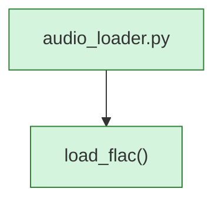

<!-- AUTO-GENERATED:BEGIN -->
## External Dependencies (auto)
### Imports
- `numpy`
- `soundfile`

## Module-level Constants and Variables (auto)
- (none detected)

## Module Workflow (auto: call graph)

## Function Inventory (auto)
- `load_flac(file_path)`
<!-- AUTO-GENERATED:END -->
