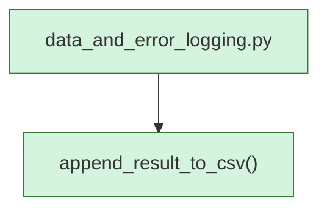

<!-- AUTO-GENERATED:BEGIN -->
## External Dependencies (auto)
### Imports
- `csv`
- `os`
- `typing.Any`
- `typing.Dict`
- `typing.Iterable`

## Module-level Constants and Variables (auto)
- `RESULT_FIELDNAMES = ['path', 'status', 'confidence', 'elapsed_s', 'samplerate_hz', 'num_samples', 'num_frames', 'nyquist_frequency_hz', 'effective_cutoff_hz', 'per_cutoff_active_fraction']`

## Module Workflow (auto: call graph)

## Function Inventory (auto)
- `append_result_to_csv(csv_path, result, fieldnames)` -> `None`
<!-- AUTO-GENERATED:END -->
