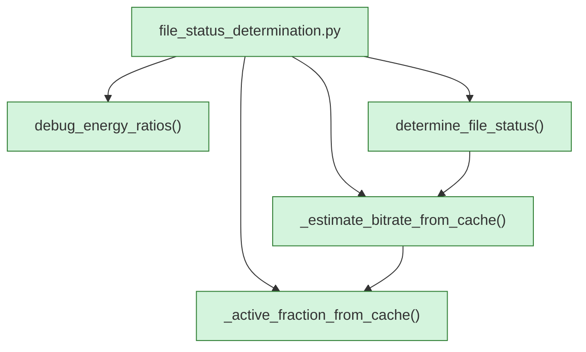

<!-- AUTO-GENERATED:BEGIN -->
## External Dependencies (auto)
### Imports
- `numpy`

## Module-level Constants and Variables (auto)
- `ENERGY_RATIO_THRESHOLD: float = 0.001`
- `MIN_ACTIVE_FRACTION: float = 0.05`
- `RATIO_DROP_THRESHOLD: float = 1e-05`
- `ORIGINAL_CONFIDENCE_GAMMA: float = 1.0`
- `MAX_HF_ACTIVE_FRACTION_FOR_CUTOFF = 0.02`
- `MIN_PREV_CUTOFF_ACTIVE_FRACTION = 0.2`
- `LOSSY_CUTOFF_PROFILES = {13000: 96, 16000: 128, 19000: 192, 20000: 256, 20500: 320}`
- `PROBE_CUTOFFS_HZ = sorted(LOSSY_CUTOFF_PROFILES.keys())`

## Module Workflow (auto: call graph)

## Function Inventory (auto)
- `_active_fraction_from_cache(frame_ffts, cutoff_hz, energy_ratio_threshold, ratio_drop_threshold)`
- `_estimate_bitrate_from_cache(frame_ffts, effective_cutoff, energy_ratio_threshold, ratio_drop_threshold, probe_cutoffs_hz)`
- `debug_energy_ratios(ratios)`
- `determine_file_status(ratios, effective_cutoff, frame_ffts, probe_cutoffs_hz)`
<!-- AUTO-GENERATED:END -->
