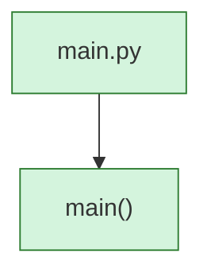

<!-- AUTO-GENERATED:BEGIN -->
## External Dependencies (auto)
### Imports
- `os`
- `run_modes.run_folder_batch`
- `run_modes.run_single_file`
- `sys`

## Module-level Constants and Variables (auto)
- (none detected)

## Module Workflow (auto: call graph)

## Function Inventory (auto)
- `main()`
<!-- AUTO-GENERATED:END -->
