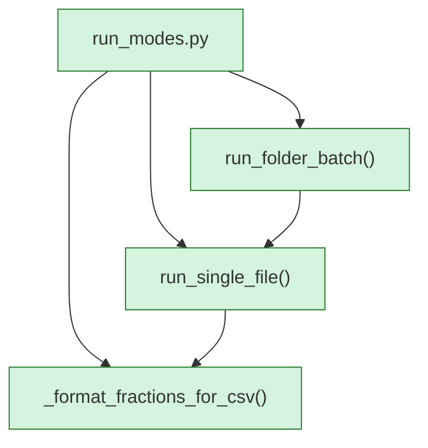

<!-- AUTO-GENERATED:BEGIN -->
## External Dependencies (auto)
### Imports
- `audio_frame_analysis.analyze_frame`
- `audio_frame_analysis.calculate_effective_cutoff`
- `audio_frame_analysis.calculate_nyquist_frequency`
- `audio_frame_analysis.divide_into_frames`
- `audio_loader.load_flac`
- `data_and_error_logging.append_result_to_csv`
- `datetime.datetime`
- `file_status_determination.determine_file_status`
- `os`
- `spectrogram_generator.spectrogram_for_flac`
- `time`
- `tqdm.tqdm`
- `typing.Any`
- `typing.Dict`
- `typing.Final`
- `typing.List`
- `typing.Optional`

## Module-level Constants and Variables (auto)
- `RESULT_FIELDNAMES: Final[List[str]] = ['path', 'status', 'confidence', 'elapsed_s', 'samplerate_hz', 'num_samples', 'num_frames', 'nyquist_frequency_hz', 'effective_cutoff_hz', 'per_cutoff_active_fraction']`

## Module Workflow (auto: call graph)

## Function Inventory (auto)
- `_format_fractions_for_csv(fractions)` -> `str`
- `run_folder_batch(folder_path)`
- `run_single_file(file_path, want_verbose, want_spectrogram)`
<!-- AUTO-GENERATED:END -->
